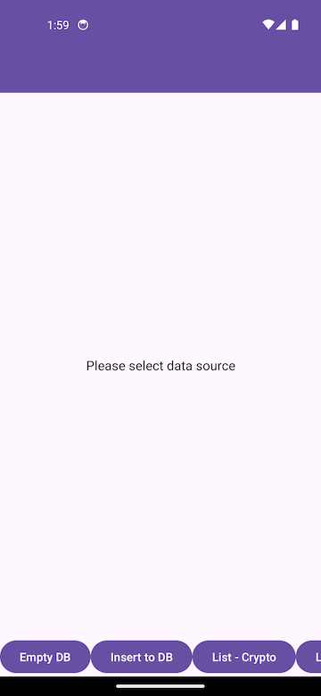
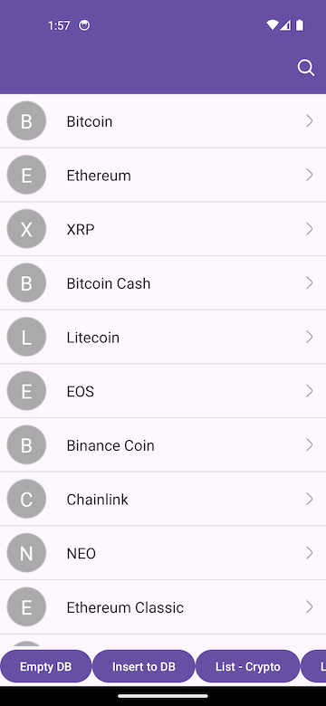
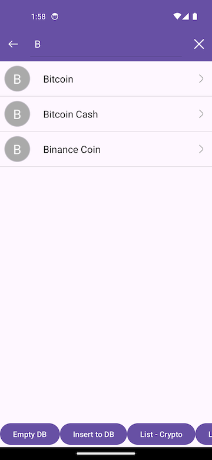
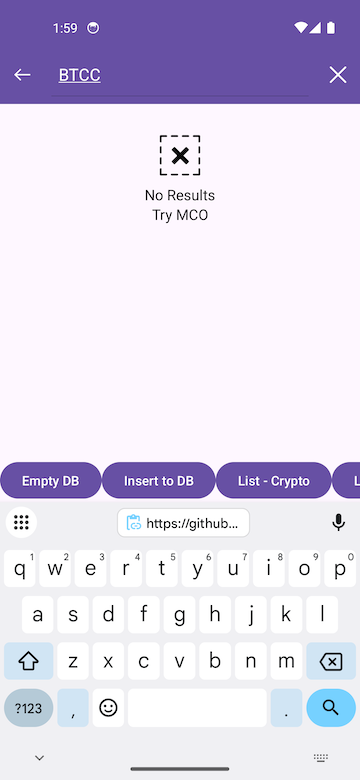

# Android App

## Features

- Koin
- MVVM
- Android Room
- Unit Testing

## Prerequisites

- Android Studio Koala Feature Drop
- Kotlin
- Android SDK (minimum API level 24)

## Screenshot









## Getting Started

### Clone the Repository

```bash
git clone https://github.com/himphen/Balaenoptera-musculus.git